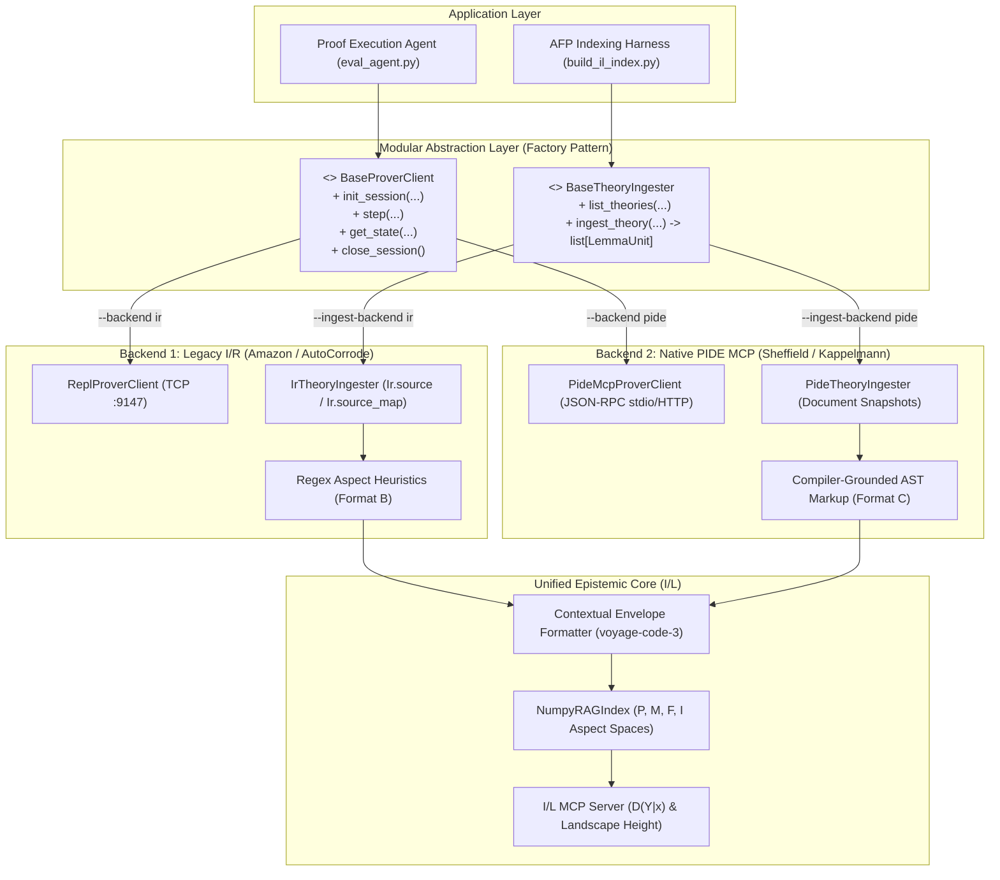

# Modular Integration Plan: PIDE MCP & I/R Dual-Backend Architecture for I/L

**Project:** EDEL / I/L (Isabelle/Landscape)  
**Author:** Luiz G. A. Correia & Research Team  
**Date:** September 2026  
**Related Documents:**
- [Isabelle Lemma Aspects.md](file:///home/correia/edel/Isabelle%20Lemma%20Aspects.md)
- [reports/pide_mcp_comparative_analysis.md](file:///home/correia/edel/reports/pide_mcp_comparative_analysis.md)

---

## 1. Architectural Strategy & Design Principles

This document specifies the technical integration plan to connect **Sheffield PIDE MCP** (Kevin Kappelmann, 2026) to the **I/L (Isabelle/Landscape)** framework, while strictly preserving full backward compatibility and runtime support for **Amazon I/R (AutoCorrode)**.

### Core Design Principles

1. **Dual-Backend Modularity:**
   - Both **Proof Execution** (in `eval_agent.py`) and **AFP Ingestion** (in `build_il_index.py` and `ingest.py`) must be decoupled from the prover transport layer.
   - The user or benchmark runner can switch between `ir` and `pide` with zero code modifications via command-line flags (`--backend [ir|pide]`) or environment variables (`IL_PROVER_BACKEND`, `IL_INGEST_BACKEND`).
2. **Zero Regression Guarantee:**
   - All existing benchmark harnesses, evaluation pipelines, and published numbers for the Complex Networks paper must remain completely executable and reproducible using the legacy I/R path.
3. **Epistemic Layer Independence:**
   - The I/L simplicial index (`NumpyRAGIndex`), the Contextual Envelope generator (`format_aspect_with_metadata`), and the epistemic navigation tools (`conditional_transition`, `search_lemmas`) remain completely agnostic of whether a theory was ingested or executed via I/R or PIDE.

---

## 2. Architecture Diagram



---

## 3. Abstract Interfaces & Contracts

### 3.1. Prover Execution Engine (`edel/il/prover_interface.py`)

```python
"""Abstract Prover Client Interface for Interactive Proving Agents."""

from __future__ import annotations
from abc import ABC, abstractmethod
from dataclasses import dataclass
from typing import Any

@dataclass
class StepResult:
    """Unified result of an executed proof step."""
    is_closed: bool
    is_error: bool
    state_text: str
    diagnostics: str = ""
    raw_response: str = ""

class BaseProverClient(ABC):
    """Abstract interface governing communication with an interactive Isabelle backend."""

    @abstractmethod
    def init_session(self, theory_import: str, lemma_name: str, statement: str) -> str:
        """Initialize proof session, load context, and establish target goal.
        
        Returns:
            Session identifier or active scratch file path.
        """
        pass

    @abstractmethod
    def step(self, command_or_edit: str) -> StepResult:
        """Execute a single tactic step or apply a document replacement.
        
        Returns:
            StepResult indicating closure, errors, and updated goal state.
        """
        pass

    @abstractmethod
    def get_state(self) -> str:
        """Return the current unproved subgoals and proof context."""
        pass

    @abstractmethod
    def close_session(self) -> None:
        """Clean up active processes, delete scratch files, and free resources."""
        pass


def get_prover_client(backend: str = "pide", **kwargs: Any) -> BaseProverClient:
    """Factory creating the appropriate prover client backend."""
    backend = backend.lower().strip()
    if backend == "pide":
        from edel.il.pide_client import PideMcpProverClient
        return PideMcpProverClient(**kwargs)
    elif backend == "ir":
        from edel.il.ir_client import ReplProverClient
        return ReplProverClient(**kwargs)
    else:
        raise ValueError(f"Unknown prover backend: '{backend}'. Supported: 'pide', 'ir'.")
```

---

### 3.2. Theory Ingestion Engine (`edel/il/ingest_interface.py`)

```python
"""Abstract Ingestion Interface for Constructing Epistemic Knowledge Indices."""

from __future__ import annotations
from abc import ABC, abstractmethod
from typing import Any
import pandas as pd

class BaseTheoryIngester(ABC):
    """Abstract interface for ingesting and decomposing AFP theories into 4-aspect units."""

    @abstractmethod
    def list_theories(self, session: str, pattern: str | None = None) -> list[str]:
        """List all available theories within a formal session."""
        pass

    @abstractmethod
    def ingest_theory(self, theory_name: str) -> list[dict[str, Any]]:
        """Extract and decompose all lemmas in a theory into structured aspect dictionaries."""
        pass

    def ingest_session(self, session: str, pattern: str | None = None) -> pd.DataFrame:
        """Batch-ingest all theories in a session into a unified DataFrame."""
        theories = self.list_theories(session, pattern=pattern)
        records = []
        for thy in theories:
            records.extend(self.ingest_theory(thy))
        return pd.DataFrame(records)


def get_theory_ingester(backend: str = "pide", **kwargs: Any) -> BaseTheoryIngester:
    """Factory creating the appropriate theory ingester backend."""
    backend = backend.lower().strip()
    if backend == "pide":
        from edel.il.pide_ingest import PideTheoryIngester
        return PideTheoryIngester(**kwargs)
    elif backend == "ir":
        from edel.il.ir_ingest import IrTheoryIngester
        return IrTheoryIngester(**kwargs)
    else:
        raise ValueError(f"Unknown ingest backend: '{backend}'. Supported: 'pide', 'ir'.")
```

---

## 4. Backend Implementation Specifications

### 4.1. The PIDE MCP Prover Backend (`edel/il/pide_client.py`)

- **Protocol:** Standard Model Context Protocol (MCP) JSON-RPC over stdio or HTTP streaming.
- **Workflow:**
  1. `init_session`: Spawns or connects to `isabelle pide_mcp`. Creates an ephemeral theory file:
     ```isabelle
     theory Scratch_Eval_<id>
       imports "<theory_import>"
     begin

     lemma <lemma_name>: "<statement>"
       sorry

     end
     ```
  2. Calls PIDE MCP `read(file=scratch_path)`.
  3. `step`: Calls PIDE MCP `edit(file=scratch_path, match="sorry", replacement=command)`.
  4. Calls `get_state(file=scratch_path, flags={...})` in a non-blocking convergence loop (polling with 50ms intervals up to a timeout).
  5. Determines closure when subgoals are empty and no error markup exists on the lemma command.
  6. **Isar Support:** Naturally supports non-linear Isar proofs by allowing the LLM agent to emit multi-line structured Isar blocks with sub-claims or localized `sorry` placeholders.

### 4.2. The Legacy I/R Prover Backend (`edel/il/ir_client.py`)

- Refactors the existing inline logic in `eval_agent.py` into `ReplProverClient`.
- Connects via `EphemeralReplClient` to `AutoCorrode/ir/repl.py` (port 9147).
- Preserves all existing `Ir.init`, `Ir.step`, and `Ir.state` calls without modifying protocol semantics.

### 4.3. The PIDE Ingestion Backend (`edel/il/pide_ingest.py`)

- Traverses document snapshots using the public Isabelle/Scala PIDE API or PIDE MCP document inspector.
- **Compiler Extraction:**
  - **Problem ($P$):** Evaluates `Logic.strip_horn(Thm.prop_of thm) |> fst` and `Variable.dest_fixes`.
  - **Method ($M$):** Resolves the formal method AST via `Markup.METHOD` on `Keyword.PRF_BLOCK`. Captures the structural milestone tree without domain citations.
  - **Finding ($F$):** Extracts the step map from `Keyword.PRF_SCRIPT` / `Keyword.PRF_SOLVE` and resolves all theorem citations via `Markup.ENTITY(Markup.THEOREM)`.
  - **Interpretation ($I$):** Evaluates `Logic.strip_horn(Thm.prop_of thm) |> snd` and parses theorem attributes (`[simp, intro]`).

### 4.4. The Legacy I/R Ingestion Backend (`edel/il/ir_ingest.py`)

- Preserves the existing `ingest_session_lemmas` logic in `edel/il/ingest.py`.
- Queries `Ir.theories`, `Ir.source`, and `Ir.source_map`.
- Decomposes commands using regex heuristics in `edel/il/aspects.py`.

---

## 5. Phased Implementation Roadmap

| Phase | Milestone | Deliverables | Validation & Acceptance Criteria |
| :---: | :--- | :--- | :--- |
| **Phase 1** | **Interface Abstraction & Factory Layer** | • `edel/il/prover_interface.py`<br>• `edel/il/ingest_interface.py`<br>• Refactor `eval_agent.py` to use `get_prover_client`<br>• Refactor `build_il_index.py` to use `get_theory_ingester` | Existing I/R test suite (`pytest tests/`) passes with 100% regression fidelity. |
| **Phase 2** | **PIDE MCP Prover Client** | • `edel/il/pide_client.py`<br>• Ephemeral scratch theory manager<br>• Asynchronous convergence polling loop for `get_state` | Successfully prove 10 test lemmas in `HOL-Library` via `python -m edel.il.eval_agent --backend pide`. |
| **Phase 3** | **PIDE Ingestion Engine** | • `edel/il/pide_ingest.py`<br>• AST aspect extractor (`Logic.strip_horn`, `Markup.METHOD`, `Markup.ENTITY`) | Ingest `Featherweight_OCL.UML_Set`. Verify 0% emptiness on $M$ and full compiler citations on $F$. |
| **Phase 4** | **Cluster Deployment on `deeptwelve`** | • Install `isabelle-pide-mcp` component in `~/lcorreia/eel`<br>• Run 50-lemma paired pilot (I/R vs. PIDE MCP) | Measure multi-core CPU scaling (`-j 64`), turn latency, and proof success rate. |

---

## 6. CLI Usage & Environment Configuration

### Configuration (`.env`)
```bash
# Prover Backend Configuration
IL_PROVER_BACKEND=pide          # "pide" | "ir" (default: "pide")
PIDE_MCP_COMMAND=isabelle       # Command to launch PIDE MCP
PIDE_MCP_ARGS=pide_mcp          # Server launch arguments
IR_HOST=127.0.0.1               # Legacy I/R host
IR_PORT=9147                    # Legacy I/R port

# Ingestion Backend Configuration
IL_INGEST_BACKEND=pide          # "pide" | "ir" (default: "pide")
IL_INDEX_THREADS=64             # Multi-core scaling for PIDE on deeptwelve
```

### CLI Execution Examples

```bash
# 1. Prover Evaluation via PIDE MCP (Next-Gen)
python -m edel.il.eval_agent --arm il_treatment --backend pide --session Featherweight_OCL

# 2. Prover Evaluation via Legacy I/R (Regression Benchmark)
python -m edel.il.eval_agent --arm il_treatment --backend ir --session Featherweight_OCL

# 3. AFP Index Construction via PIDE Snapshots (Next-Gen)
python -m edel.il.build_il_index --session Featherweight_OCL --ingest-backend pide --threads 64 --output artifacts/rag_index_pide

# 4. AFP Index Construction via Legacy I/R (Reproducibility)
python -m edel.il.build_il_index --session Featherweight_OCL --ingest-backend ir --token $IR_AUTH_TOKEN --output artifacts/rag_index_ir
```

---

## 7. Strategic Impact

1. **Safety & Reproducibility:** Preserves all existing benchmarks and code paths without disruption.
2. **Cluster Efficiency:** Leverages all 64 cores on `deeptwelve` via Isabelle/Scala PIDE, removing the single-threaded Poly/ML bottleneck.
3. **Epistemic Quality:** Replaces brittle regex string-splitting with compiler-verified AST extraction, generating a mathematically rigorous 4-aspect simplicial complex.
