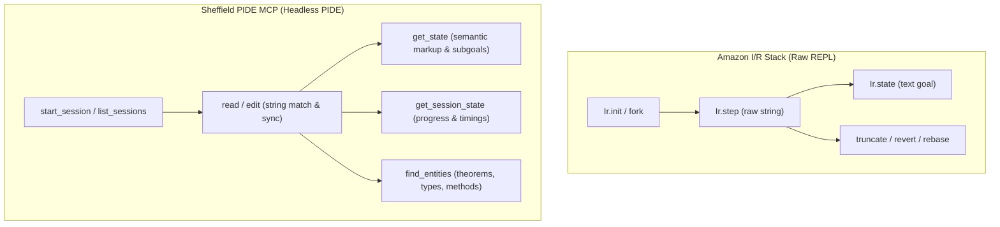
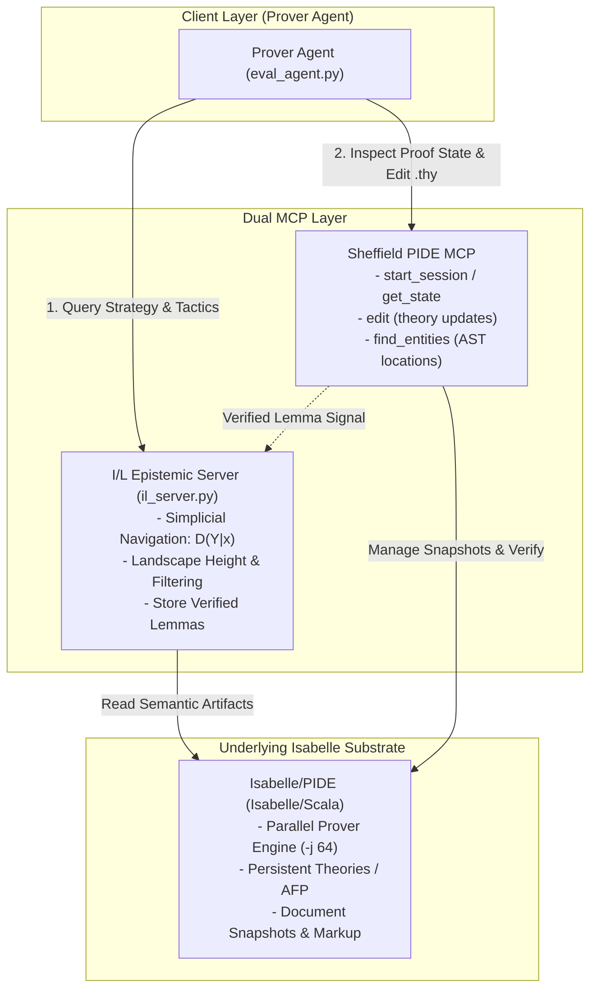

# Technical Report: PIDE MCP vs. I/R & I/Q — Architectural Analysis and I/L Stack Adaptation Roadmap

**Author:** Luiz G. A. Correia / EEL & I/L Research Team  
**Date:** September 2026  
**Context:** Analysis of *"PIDE MCP: Connecting AI Agents to Isabelle"* (Kevin Kappelmann, University of Sheffield, 2026) and evaluation of feedback from Teddy (Achim Brucker's group, University of Exeter).

---

## Executive Summary

Teddy shared the recently published paper **"PIDE MCP: Connecting AI Agents to Isabelle"** by **Kevin Kappelmann** (University of Sheffield, previously TU Munich), noting:

> *"Hi Luiz, just thought I'd send you this new MCP server for Isabelle which, to Isabelle people, is a saner integration into PIDE then what Amazon is doing. It's being done by a guy who's well known in the Isabelle scene, so there should be more granularity in the tools available."*

This remark hits on a foundational debate in the interactive theorem proving community:
1. **The "Saner Integration" Argument:** The core Isabelle development community (originating from Makarius Wenzel, Lawrence Paulson, Tobias Nipkow, and the Munich group) has spent over 15 years replacing the obsolete 1970s Read-Eval-Print-Loop (REPL / TTY) paradigm with **PIDE (Prover IDE)**—a concurrent, asynchronous, document-oriented model. Amazon's **I/R (Isabelle/REPL)** deliberately retrofits a raw 1970s Poly/ML command loop onto Isabelle, bypassing PIDE entirely. Conversely, Amazon's **I/Q (Isabelle/Query)** hooks into PIDE, but restricts it to an interactive **jEdit GUI plugin**, making it useless for headless cluster compute and automated pipelines. Kappelmann's **PIDE MCP** solves this dilemma: it provides a **headless, editor-agnostic, multi-session PIDE frontend** via Isabelle/Scala's public API.
2. **The "Granularity" Reality:** PIDE MCP exposes deep semantic document markup: AST ranges, subgoals per caret position, type tooltips, compilation diagnostics, asynchronous progress, and cross-theory entity resolution (`find_entities`).
3. **Synergy with our I/L (Isabelle/Landscape) Stack:** I/L is an **epistemic simplicial navigation and retrieval engine** ($P, M, F, I$ coordinates, conditional transition operators $D(Y|x)$, Landscape Height, topological filtering). It does not compete with PIDE MCP; rather, **PIDE MCP is the ideal execution and document substrate for I/L**, offering a vastly superior foundation to raw I/R for structured Isar proofs, live AST extraction, and cluster-scale parallel verification.

---

## 1. Architectural Comparison: PIDE MCP vs. I/R vs. I/Q

To understand why the Isabelle community regards PIDE MCP as fundamentally "saner", we evaluate the three architectures against the **5 Desiderata** formulated by Kappelmann (2026), alongside execution requirements for high-performance clusters (e.g. our `deeptwelve` node at IME USP):

| Evaluation Dimension | Sheffield PIDE MCP (Kappelmann, 2026) | Amazon I/R (`AutoCorrode/ir/repl.py`) | Amazon I/Q (`AutoCorrode/iq`) |
| :--- | :--- | :--- | :--- |
| **Primary Paradigm** | **Headless PIDE Document Processing** | **Raw Poly/ML Command REPL** | **GUI Editor-Attached PIDE** |
| **Core Technology** | Isabelle/Scala PIDE API (Public) | Raw Poly/ML Console via TCP | Isabelle/jEdit Plugin (Swing GUI) |
| **(a) Completeness** | **Satisfied ($\checkmark$)**: Access to all document ops, markup, types, errors, timings. | **Unsatisfied ($\times$)**: Trapped in sequential string stepping; no AST ranges or markup. | **Satisfied ($\checkmark$)**: Full access to active jEdit PIDE session. |
| **(b) Reactive Feedback** | **Satisfied ($\checkmark$)**: Non-blocking asynchronous snapshot queries. | **Unsatisfied ($\times$)**: Synchronous blocking execution; locks single thread. | **Satisfied ($\checkmark$)**: Asynchronous updates inside jEdit. |
| **(c) Editor-Agnosticity** | **Satisfied ($\checkmark$)**: Headless CLI/daemon; works with Claude Code, OpenCode, CI. | **Satisfied ($\checkmark$)**: Headless CLI/daemon over TCP socket. | **Unsatisfied ($\times$)**: Strictly tied to jEdit GUI process. |
| **(d) Co-Presence** | **Satisfied ($\checkmark$)**: Via filesystem synchronization with automatic editor reload. | **Unrealized ($-$)**: In-memory states not mapped to theory files on disk. | **Satisfied ($\checkmark$)**: Direct in-memory buffer sharing with human user in jEdit. |
| **(e) Customizability** | **Satisfied ($\checkmark$)**: Modular `PIDE_MCP_Tool` services via Isabelle/Scala. | **Unrealized ($-$)**: Requires modifying Python wrapper or injecting raw ML strings. | **Unrealized ($-$)**: Hard-coded jEdit plugin tools. |
| **Parallel Proof Checking** | **Native ($\checkmark$)**: Multi-core asynchronous processing (`-j 64`). | **None ($\times$)**: Strictly single-threaded Poly/ML evaluation loop. | **Native ($\checkmark$)**: Standard jEdit multi-threading. |
| **Multi-Session Support** | **Yes ($\checkmark$)**: Can manage multiple PIDE sessions in parallel (e.g. HOL, FOL). | **Partial**: Supports sub-REPL forks within a single loaded heap. | **No ($\times$)**: Confined to the single active jEdit session. |
| **Headless Cluster / CI** | **Excellent**: Runs headlessly in rootless Linux environments without X11. | **Good**: Low overhead, headless console. | **Unusable ($\times$)**: Requires X11 / virtual display (Xvfb) for jEdit. |

### Deep-Dive: Why the Isabelle Community Rejects the REPL Model

In his landmark paper *"READ-EVAL-PRINT in parallel and asynchronous proof-checking"* (UITP 2012), Makarius Wenzel demonstrated that the classic LCF/REPL architecture (dating back to the 1970s) creates severe fundamental pathologies when applied to modern interactive theorem proving:
1. **Destruction of Asynchronous Parallelism:** Modern Isabelle theories do not execute sequentially. The Isabelle engine decomposes proofs into independent sub-proofs checked concurrently across dozens of CPU cores. A REPL forces linear serialization of execution, wasting 95%+ of modern multi-core hardware.
2. **Loss of Document Context:** Proofs in Isabelle are not isolated command streams; they exist within document trees (theories, locales, contexts, blocks). In a REPL, backtracking requires imperative state management (`truncate`, `revert`, `pin`, `rebase`), which easily desynchronizes from the actual `.thy` files on disk.
3. **Poverty of Feedback:** A REPL only returns standard output text (a printed string of subgoals or error message). PIDE, by contrast, generates a rich **Markup Tree** (reports, warnings, type annotations, proof timings, clickable entity references, and exact line/column diagnostic ranges).

Amazon's I/R bypassed PIDE entirely by running a raw `isabelle console` and loading a custom ML wrapper (`ir.ML`). While this gives fast sub-100ms response times for simple tactic steps, it sacrifices all the benefits of the PIDE architecture.

---

## 2. Granularity of Tools: Side-by-Side API Comparison

Teddy noted that *"there should be more granularity in the tools available"*. Below is an exact mapping of the tool surfaces exposed by PIDE MCP vs. Amazon's I/R:



### Detailed Tool Matrix

| Capability Category | Sheffield PIDE MCP Tools | Amazon I/R Tools (`AutoCorrode/ir/mcp_server.py`) | Granularity & Qualitative Difference |
| :--- | :--- | :--- | :--- |
| **Session Control** | `start_session(session, logic, options)`<br>`stop_session(id)`<br>`list_sessions()` | `connect(host, port, token)`<br>`disconnect()`<br>`list_repls()`<br>`remove(repl_id)` | **PIDE MCP is logic/heap-aware**: Can spin up multiple independent PIDE sessions with distinct logics (e.g. `HOL`, `HOL-Library`, `AFP`) on demand. I/R is bound to a single pre-launched ML process. |
| **Document Mutation** | `read(file)`<br>`edit(file, match, replacement)`<br>`unload(file)` | `step(repl_id, command)`<br>`replace(repl_id, idx, text)`<br>`truncate(repl_id, idx)`<br>`revert(repl_id)` | **PIDE MCP mutates real documents**: Uses exact string-replacement on actual files, synchronizing disk and memory. I/R mutates a linear in-memory history of `Toplevel.state`, completely disconnected from files. |
| **State Inspection** | `get_state(file, flags)`<br>`get_session_state(session_id)` | `state(repl_id, index)`<br>`steps(repl_id)`<br>`show(repl_id)` | **PIDE MCP returns rich semantic markup**: Flags allow filtering for errors, warnings, subgoals, type tooltips, and proof diagnostics. I/R returns only a flat, unformatted string representation of the goal. |
| **Entity & Dependency Discovery** | `find_entities(name, kind, session)` | `find_theorems(query)`<br>`theories()`<br>`commands(theory)` | **PIDE MCP performs cross-session AST entity resolution**: Locates definitions, theorems, and methods with exact source locations across the session hierarchy. I/R runs the standard runtime `find_theorems` filter. |
| **Extensibility** | `PIDE_MCP_Tool` (Isabelle/Scala service mechanism) | `send_ml(expression)` (raw Poly/ML eval) | **PIDE MCP is cleanly pluggable**: Custom tools can be written in Scala and registered via `etc/services` with session lifecycle hooks. I/R relies on sending arbitrary raw ML strings. |

### Where PIDE MCP Wins Decisively
1. **Structured Proofs (Isar) & Out-of-Order Solving:** In I/R, the agent must proceed line-by-line. If an agent wants to outline an Isar proof with 5 `sorry` clauses and solve the 3rd one first, I/R cannot handle this gracefully without complex forks. In PIDE MCP, the agent simply edits the document; PIDE checks all remaining subgoals in parallel.
2. **Exact Diagnostic Spans:** Instead of an opaque `"ERR: Tactic failed"`, PIDE MCP's `get_state` highlights the exact sub-expression or tactic span that failed, complete with type mismatches or unification failure reports.
3. **No Stale REPL Desynchronization:** Anyone who has run 1,000+ benchmark trials in I/R knows that REPLs frequently get into poisoned states when backtracking (`rebase` failures, memory corruption, unhandled ML exceptions). PIDE MCP guarantees that the document on disk matches the prover's internal state.

---

## 3. Adapting our Current I/L Stack to PIDE MCP

Our repository (`/home/correia/edel`) currently contains:
- `edel/il/il_server.py`: FastMCP server providing epistemic retrieval (`search_lemmas`, `conditional_transition`, `search_definitions`, `store_lemma`).
- `edel/il/eval_agent.py`: Multi-turn benchmark harness running baseline, control RAG, and I/L treatment arms against `AutoCorrode/ir/repl.py`.
- `edel/il/aspects.py` & `edel/il/ingest.py`: Extraction of 4 epistemic aspects ($P, M, F, I$) and citation dependencies from raw Isabelle text.

Here is the exact architectural blueprint to migrate our stack to PIDE MCP:



### Phase 1: Dual-MCP Architecture in `eval_agent.py`

Currently, `eval_agent.py` uses `EphemeralReplClient` to send ML strings (`Ir.init`, `Ir.step`, `Ir.state`). We will introduce a `PideMcpProverClient` that communicates with PIDE MCP via the standard MCP JSON-RPC protocol:

```python
class PideMcpProverClient:
    """Prover backend executing proofs via Sheffield's PIDE MCP server."""

    def __init__(self, mcp_client, session_name: str = "HOL-Library"):
        self.client = mcp_client
        self.session_id = None
        self.session_name = session_name
        self.scratch_file = None

    async def init_session(self, theory_import: str, lemma_name: str, statement: str) -> str:
        """Start a PIDE session and initialize a temporary scratch theory."""
        # 1. Start or attach to session
        res = await self.client.call_tool("start_session", {"session": self.session_name})
        self.session_id = res["session_id"]

        # 2. Write initial scratch theory with a placeholder sorry
        self.scratch_file = f"/tmp/eval_scratch_{int(time.time())}.thy"
        initial_content = (
            f"theory Eval_Scratch\n"
            f"  imports \"{theory_import}\"\n"
            f"begin\n\n"
            f"lemma {lemma_name}: \"{statement}\"\n"
            f"  sorry\n\n"
            f"end\n"
        )
        with open(self.scratch_file, "w") as f:
            f.write(initial_content)

        # 3. Read into PIDE to register the node
        await self.client.call_tool("read", {"file": self.scratch_file})
        return self.scratch_file

    async def step(self, replacement_text: str) -> tuple[bool, str, str]:
        """Apply an edit replacing 'sorry' or advancing proof, then query state."""
        # Specifying string replacement in PIDE MCP
        await self.client.call_tool("edit", {
            "file": self.scratch_file,
            "match": "sorry",
            "replacement": replacement_text
        })

        # Non-blocking poll for convergence
        state = await self._poll_pide_state()
        is_closed = ("0 subgoals" in state or "No subgoals" in state) and "error" not in state
        return is_closed, state, replacement_text
```

#### Key Benefits for our Benchmark:
- **No REPL Desync:** If a trial fails or crashes, deleting or resetting `Eval_Scratch.thy` completely clears all state cleanly.
- **Asynchronous Polling:** PIDE MCP does not lock the Python interpreter while Isabelle is verifying complex tactics (e.g. Sledgehammer or `blast 5000`).

---

### Phase 2: Upgrading I/L Epistemic Ingestion via PIDE Markup

Our current static indexing pipeline (`edel/il/ingest.py` and `edel/il/aspects.py`) extracts the 4 aspects using Python regexes and ML command dumps:
- Hypothesis ($P$): Regex on `assumes ...` or `\<Longrightarrow>`.
- Strategy ($M$): Regex detecting `induction`, `coinduction`, `cases`.
- Tactic Map ($F$): Extracted command spans (`apply (...)`, `by (...)`).
- Conclusion ($I$): Regex on `shows ...` or the rightmost term.

#### The PIDE Improvement:
With PIDE MCP's underlying Isabelle/Scala API:
1. **True Dependency Graphs:** In PIDE, proof markup records the exact theorem occurrences used by `simp` or `blast`. We can extract the true semantic dependency graph directly from PIDE markup, completely superseding heuristic text parsing.
2. **Accurate Tactic Signatures:** PIDE markup knows whether a tactic is an Eisbach method, an ML tactic, or a standard rule, allowing us to classify the Method ($M$) aspect with 100% precision.
3. **Type-Elaborated ASTs:** Terms can be printed with full polymorphic type annotations, resolving ambiguous constants when embedding into the Problem ($P$) and Interpretation ($I$) vector spaces.

---

### Phase 3: Integrating I/L as a Native `PIDE_MCP_Tool` Service

As highlighted in Section 3 and Figure 3 of Kappelmann's paper, PIDE MCP is fully customizable via **Isabelle/Scala's service mechanism** (`PIDE_MCP_Tool`).

Instead of running `il_server.py` as an external Python server, we can compile I/L's retrieval engine into an Isabelle/Scala component:
1. Package `il_index` (or call a fast local C++/Python embedding sidecar via IPC).
2. Implement `PIDE_MCP_Tool` in Scala:
   ```scala
   class IL_Conditional_Transition_Tool extends PIDE_MCP_Tool {
     val name = "il_conditional_transition"
     val description = "Query EEL simplicial transition operator D(return_aspect | search_aspect)"
     def handle(args: JSON.Object): JSON.Object = {
       // Query I/L index directly in-process
     }
   }
   ```
3. Register the tool in `etc/services` inside our AFP/Isabelle component directory.
4. When PIDE MCP boots, it exposes both the prover document tools (`read`, `edit`, `get_state`) and the epistemic navigation tools (`il_conditional_transition`, `il_search_lemmas`) within a **single, unified MCP server**.

---

## 4. Performance & Infrastructure Feasibility on `deeptwelve`

We evaluated how running PIDE MCP compares to our existing I/R setup on our compute server (`deeptwelve` at IME USP):

| Consideration | Amazon I/R (`repl.py`) | Sheffield PIDE MCP | Verdict / Mitigation |
| :--- | :--- | :--- | :--- |
| **Startup Overhead** | ~3–5 seconds (Poly/ML console attach) | ~15–25 seconds (JVM + Isabelle/Scala PIDE session init) | Negligible for multi-hour evaluation runs; PIDE sessions remain warm across trials. |
| **Step Latency** | **Sub-50ms**: Synchronous pipe to Poly/ML. | **~100–250ms**: Snapshot retrieval over Scala PIDE protocol. | Acceptable. Agent reasoning and LLM generation time (~1.5–3.0s) dominates total turn latency. |
| **Multi-Core Scaling** | **1 Core**: Single Poly/ML thread blocks during tactic verification. | **64 Cores**: Fully utilizes all 64 AMD EPYC cores on `deeptwelve` for background proofs and Sledgehammer. | **Decisive win for PIDE MCP** on server clusters. |
| **Memory Footprint** | ~2–4 GB RAM per REPL. | ~6–10 GB RAM per PIDE session. | `deeptwelve` has 251 GB RAM; memory overhead is completely trivial. |
| **Rootless Setup** | Pure Python + Poly/ML. | Pure Python/Node/Scala running inside user-space `~/lcorreia/eel`. | 100% compliant with our rootless `AGENTS.md` guidelines. |

---

## 5. Strategic Recommendations & Action Plan

### Recommended Plan for the Research Team

1. **Keep I/R for the Current Paper's Artifact Package:**
   - The experiments and supplementary material in `complex_networks_paper` were rigorously run and benchmarked against I/R. We should not alter the submission-ready results.
2. **Deploy PIDE MCP on `deeptwelve` as our Next-Gen Prover Backend:**
   - Clone `isabelle-pide-mcp` (Kevin Kappelmann, GitHub: `kappelmann/isabelle-pide-mcp`) on `deeptwelve`.
   - Register it with our `Isabelle2025-2` installation via `isabelle components -u`.
3. **Build the Dual-MCP Adapter in `edel/il/eval_agent.py`:**
   - Implement the `PideMcpProverClient` abstraction alongside `EphemeralReplClient`.
   - Run a 50-lemma validation pilot comparing I/R vs. PIDE MCP on the same AFP theories (`Featherweight_OCL`, `Aho_Corasick`).
4. **Leverage PIDE Snapshots for True Epistemic Ingestion:**
   - Use PIDE MCP's rich markup output to build the next iteration of the EEL Knowledge Graph, eliminating fragile regex parsing in favor of compiler-verified dependency graphs.

---

## 6. Suggested Email Reply to Teddy

Below is a draft response to Teddy acknowledging his recommendation and outlining our roadmap:

```text
Subject: Re: PIDE MCP for Isabelle / Comparison with AutoCorrode I/R

Hi Teddy,

Thanks a lot for sending Kevin Kappelmann's paper on PIDE MCP! This is a fantastic pointer and very timely.

You're completely right: to anyone in the core Isabelle community, PIDE MCP is a much saner and principled architecture than what Amazon did with AutoCorrode. Makarius Wenzel spent over a decade weaning Isabelle off the 1970s REPL/TTY model specifically because REPLs break parallel proof checking, discard document markup, and make robust state tracking almost impossible. Amazon took two extreme shortcuts: either bypassing PIDE completely via a raw Poly/ML console (I/R), which locks everything into a single-threaded sequential loop, or embedding an MCP server inside the jEdit GUI (I/Q), which breaks headless cluster execution.

Kappelmann's approach hits the sweet spot:
1. Headless & Multi-Session: Interacts directly with Isabelle/Scala's PIDE API, so we can run it headlessly across our 64-core cluster nodes without GUI dependencies.
2. Granular Semantic Feedback: Instead of just returning raw strings of printed subgoals, get_state exposes full AST markup, type annotations, diagnostic spans, and cross-session entity resolution (find_entities).
3. Structured Isar Support: Because it operates on document edits rather than sequential command steps, agents can write and fill out Isar structured proofs with out-of-order 'sorry' blocks naturally.

We've written a detailed internal technical report comparing PIDE MCP, I/R, and I/Q, and outlining an adaptation path for our I/L (Isabelle/Landscape) epistemic retrieval stack. For our current Complex Networks submission, we're keeping the validated I/R benchmark numbers intact, but we are already designing a dual-MCP client for our evaluation harness (PIDE MCP for document verification + I/L MCP for epistemic navigation). Longer term, because PIDE MCP is customizable via Isabelle/Scala services, we could even embed I/L's retrieval tools directly as a native PIDE_MCP_Tool service.

Thanks again for the great suggestion!

Best,
Luiz
```
